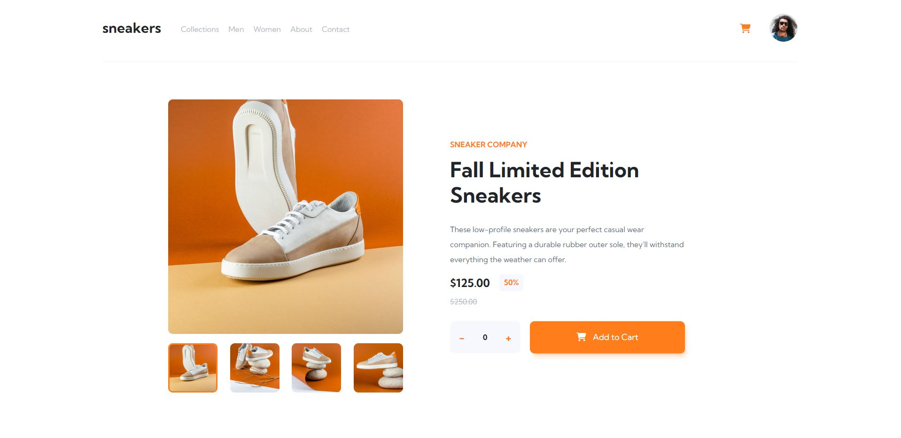
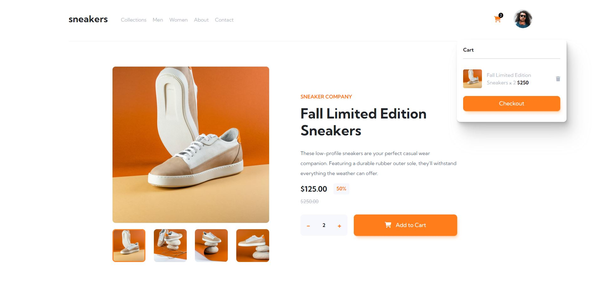
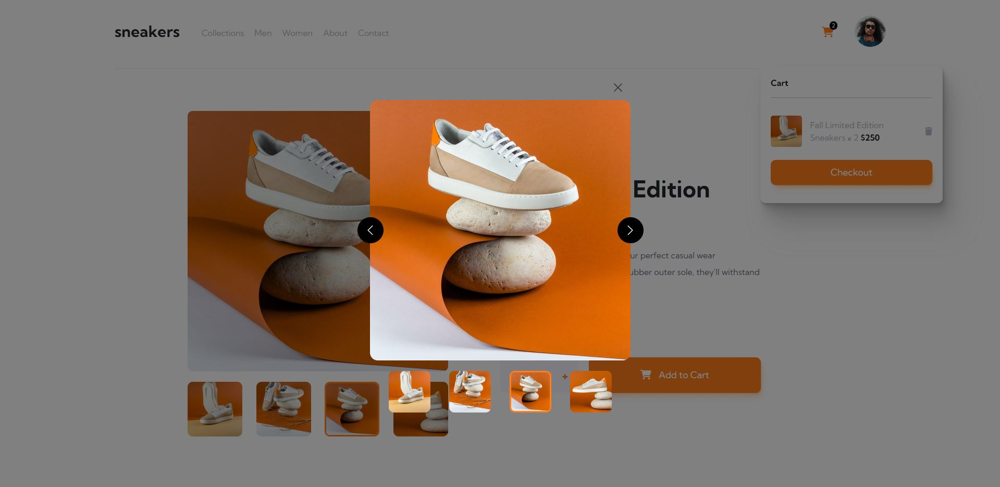

# Frontend Mentor - E-commerce product page solution by Eivind Simonsen

This is a solution to the [E-commerce product page challenge on Frontend Mentor](https://www.frontendmentor.io/challenges/ecommerce-product-page-UPsZ9MJp6). Frontend Mentor challenges help you improve your coding skills by building realistic projects.

## Table of contents

- [Overview](#overview)
  - [The challenge](#the-challenge)
  - [Screenshot](#screenshot)
  - [Links](#links)
- [My process](#my-process)
  - [Built with](#built-with)
  - [What I learned](#what-i-learned)
  - [Continued development](#continued-development)
  - [Useful resources](#useful-resources)
- [Author](#author)
- [Acknowledgments](#acknowledgments)

**Note: Delete this note and update the table of contents based on what sections you keep.**

## Overview

### The challenge

Users should be able to:

- View the optimal layout for the site depending on their device's screen size
- See hover states for all interactive elements on the page
- Open a lightbox gallery by clicking on the large product image
- Switch the large product image by clicking on the small thumbnail images
- Add items to the cart
- View the cart and remove items from it

### Screenshot

;
;
;

### Links

- Solution URL: [https://github.com/eivindsimonsen/react-ecommerce](https://github.com/eivindsimonsen/react-ecommerce)
- Live Site URL: [https://react-ecommerce-eas.netlify.app/](https://react-ecommerce-eas.netlify.app/)

## My process

### Built with

- [React](https://reactjs.org/) - JS library
- SCSS/SASS
- Bootstrap

### What I learned

I've gained more knowledge on how to manage states, sending informationa across components, and connecting components with useContext. I've also used more of CSS Grid.

```js
// Quantity.jsx
const decrement = () => {
  if (count === 0) {
    return;
  } else {
    setCount(count - 1);
    setPrice(price - 125);
  }
};

// These values is sent to content.jsx
props.quantity(count);

// Content.jsx
const pullCount = (data) => {
  setFindCount(data);
};

<Quantity quantity={pullCount} />;
```

### Useful resources

- [ChatGPT3](https://openai.com/blog/chatgpt/) - This helped me with solving different bugs, especially in the gallery component, as active classes was not set to the correct image displayed.
